# Business Continuity Manual  

Business Continuity Plan: E4 Power Distribution System  

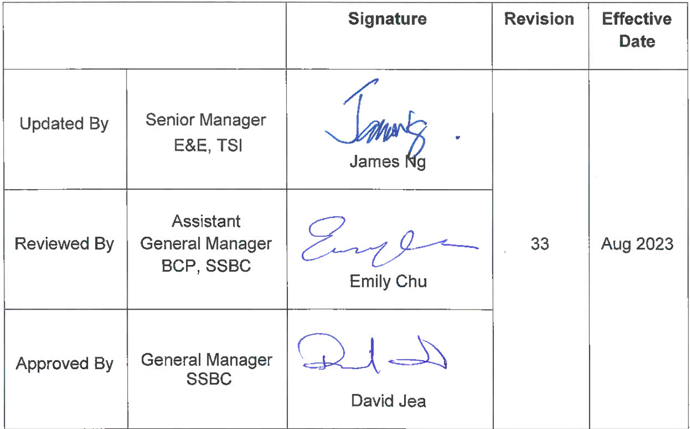  

Blank Page  

# BCP – E4. Power Distribution System Table of Contents  

# SUBJECT MATTER  

PAGE  

A System Description E4.5   
B Physical System Risk E4.8   
C Contingency Planning for Power Distribution System E4.8   
D Contingency Procedures during the Tropical Cyclones E4.18   
E Cyber Security E4.18   
F Interface with Other Operational Organizations during Contingency E4.19  

Blank Page  

# A. System Description HV Distribution System  

# 1.1 Terminal 1  

1.1.1 The incoming main high voltage power supply (11kV) for T1 are provided by CLP primary 132/11kV substation APA & APB supply via their respective CLP customer switching stations, A, B, C & CH.  High voltage emergency power supply is feeding for T1 from the standby HV generators and Battery Energy Storage System (BESS) located at Generator House 1 (GH1).  

1.1.2 Four main 11kV switch stations situated at different locations in Terminal 1 (T1), namely PA, PB, PC and PH. HV switchboards are dedicated to supplying the Ring Main Units (RMUs) and/or to the chillers in each substation.  

1.1.3 There are 20 substations in T1, namely A1, A2, A3, A4, A6, B1, B2, B3, B4, B5, C1, C2, C3, C4, C5, C6, C7, C8, C8A and C9. Each substation houses the RMUs and HV/LV transformers, which are connected from their respective RMUs and feed to LV distribution boards.  

1.1.4 The CLP distribution rooms are interconnected with HV switchboards in a HV/LV cabling network and the HV switchboards give input/output signals required by the HV Supervisory Control and Data Acquisition (SCADA) and Intelligent Protection, Automation, Control and Supervision (IPACS) systems.  

1.1.5 HV SCADA system provides the remote monitoring, control, protection and automatic supply transfer functions for the HV distribution network in case of power failure. The IPACS system is the backup system for providing the automatic supply transfer function if the HV SCADA system fails.  

1.1.6 Two under voltage relays and two three-phase 11kV/380V Voltage Transformers are installed at busbars on both sides of the 11kV switchboard. In case of CLP power failure, the four under voltage relays will be triggered and thus under voltage input signals will be sent to REF AS Bay Modules located inside HVSCADA/IPACS local panels in Substations PA, PB, PC and PH in T1, initiating the supply transfer and load shedding operations at 11kV switch stations.  

# 1.2 T1 Satellite Concourse (T1S)  

1.2.1 The incoming high voltage power supply (11kV) for T1S is provided by CLP customer switching station A through airfield substation EX.  

1.2.2 The airfield SCADA system provides remote switching and monitoring functions for the HV distribution network.  

# LV Distribution System  

# 2.1 Terminal 1  

2.1.1. The low voltage sub-main distribution system consists of LV main switchboards, which distribute electrical power from the main transformers to various LV distribution boards. There are 20 LV switch stations in T1. Each LV switch station is supplied by at least two different HV power sources such that the lighting and general power in each zone can be fed from at least two different sources.  

2.1.2. The LV distribution boards supply electricity to lighting and general power circuits to various locations.  

2.1.3. For gantry lighting, lighting circuits of each zone are distributed from three gantry Lighting & Power (L&P) boards, which are supplied by different HV power sources. This setup ensures that only one-third of gantry lighting would be affected if there is a power interruption of either one of the HV power sources.  

2.1.4. For public lighting and small power, L&P boards are responsible for each centralized zone and the L&P boards are supplied by different HV power sources. In case of power interruption, only one-third of L&P in the centralized zone would be affected.  

2.1.5. The GBMS control circuits of L&P boards are protected by UPS. The control circuit supply of lighting circuits would not be disrupted in case of a power failure or voltage dip in the incoming sources.  

2.1.6. For aircraft loading bridges and apron high mast lightings, power supplies are connected to 8 different HV switchboard bus sections, namely “PA-1”, “PA-2”, “PB-1”, “PB-2”, “PC-1”, “PC2”, “PH-1” and “PH-2”, at Substations PA, PB, PC and PH respectively. In case of power failure from any one bus-section of HV switchboards, 87% of aircraft loading bridges and apron high mast lights can still be maintained and therefore the adverse impact in a concentrated zone would spread out.  

2.1.7. For baggage handling system, power supply to the primary sorters, secondary sorters and delivery lines of BHS are connected to different transformers from different HV switching stations “PA”, “PB”, “PC” and “PH”. In case of power failure in any one of HV switching stations, 100% of Baggage Handling System can still be maintained in normal operation after supply changeover operation.  

# 2.2. Terminal 1 Annex Building, Sky Bridge, Terminal 2, T1 Satellite Concourse, SkyPier Terminal, GTC & Ground Transportation Lounge  

2.2.1. The LV distribution boards serve to distribute lighting and general electrical power circuits to various locations.   
2.2.2. The GBMS control circuits of L&P boards are protected by UPS. The control circuit supply of lighting circuits would not be disrupted in case of the power failure or voltage dip from the incoming sources.   
2.2.3. The emergency power system consists of LV Generators and is used to backup main power supply. When the main power is lost, the Emergency Power System would automatically cut-in within 15 seconds and provide power supply to those equipment classified as “essential”.  

# 2.3. Integrated Airport Center (IAC)  

2.3.1. The Integrated Airport Center is supplied by different CLPP LV feeders with essential supply backup by 2 nos. local LV emergency generators.  

2.3.2. In case of either one supply power is unstable or loss, the   auto changeover function would be activated to maintain the electrical power. When city main power recovers, manual operation for system resume to normal status is required.  

2.3.3. In case of both supplies are loss, mobile LV generators could be mobilized and provide power to the IAC.  

2.3.4. The LV distribution boards serve to distribute lighting and general electrical power circuits.  

2.3.5. The critical loading are protected by 2 sets of 825kVA UPS. The electrical power would not be disrupted in case of the power failure or voltage dip from the incoming sources.  

# 2.4. T1 Midfield Concourse  

2.4.1. The T1 Midfield Concourse is supplied by LV feeders by CLP Power (CLPP) via 11 LV Switchboard with essential supply backup by 8 nos. LV generators.  

2.4.2. The emergency power system consists of LV Generators and is used to backup main power supply. When the main power is lost, the Emergency Power System would automatically cut-in  

# Airport Authority Hong Kong  

within 15 seconds and provide power supply to those equipment classified as “essential”.  

2.4.3. The GBMS control circuits of L&P boards are protected by UPS, and the control circuit supply would not be disrupted in case of the power failure or voltage dip from the incoming sources.  The public lighting is controlled by the Digital Addressable Lighting Interface (DALI )system which is designed to be fail-safe and will remain the last status in case of voltage dip.  

# B.  Physical System Risk  

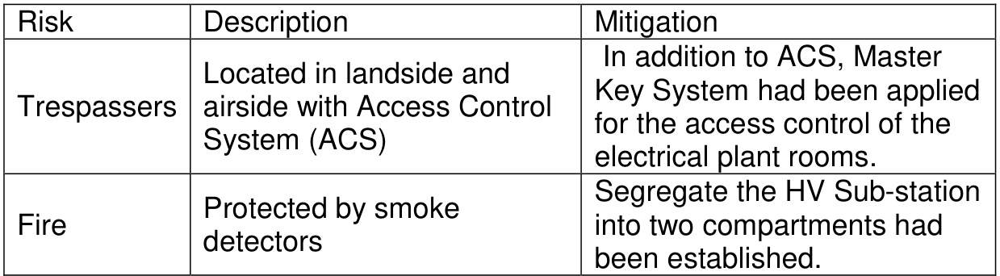  

# C. Contingency Planning for Power Distribution System  

# 1.0 Criteria for activating contingency plan  

Below are the possible fault scenarios but not limited to the other unexpected fault conditions:-  

1.1 Scenario 1 – YELLOW warning condition CLP power healthy + HVSCADA/IPACS system failure + No activation of supply transfer   
1.2 Scenario 2 – BROWN warning condition CLP power healthy + HVSCADA/IPACS system failure + Activation of supply transfer due to false signal (Supply Transfer FULLY completed)   
1.3 Scenario 3 – ORANGE warning condition CLP power healthy + HVSCADA/IPACS system failure + Activation of supply transfer due to false signal (Supply Transfer PARTIALLY completed)   
1.4 Scenario 4 – RED warning condition CLP power failure + HVSCADA/IPACS system healthy   
1.5 Scenario 5 – BLACK  warning condition CLP power failure + HVSCADA/IPACS system failure  

# 2.0 CLP power failures denotes as :-  

2.1 CLP power failure at switch station PA only;   
2.2 CLP power failure at switch station PB only ;   
2.3 CLP power failure at switch station PC only ;   
2.4 CLP power failure at switch station PH only ;   
2.5 CLP power failure at more than two switch stations.  

# 3.0 HVSCADA/IPACS system failures denotes as:-  

3.1 Supply Transfer (ST) Fail alarm received at FRTMO   
3.2 ABB REF Bay Module failure   
3.3 Both 2 PLCs fault alarm in Generator Interfacing Panel   
3.4 Communication channel fail between two Bay Modules in the   
HVSCADA/IPACS panel  

# 4.0 Services and manpower involved  

FRT Duty Authorized Person must hold a certificate of Registered Electrical Worker with Grade H and Permitted Work type (A/B/C). They shall be registered and authorized by TSI according to Procedure TS-I-P/T/003 “Electrical System – Operation and Maintenance”.  

# 5.0 Contingency Procedures  

A minimum acceptable services standard in case of total power failure for incoming CLP power supplies and airport services are maintained under generator power supplies, which can be summarized as follow:  

5.1 Maintain Terminal Temperature at 26oC,   
5.2 Maintain at least 75% lighting during power interruption,   
5.3 Maintain BHS 100% available after supply changeover,   
5.4 Maintain supply to at least 7/8 loading bridge and high mast lighting;  

# 6.0 Contingency Measures  

6.1 Scenario 1 – YELLOW  warning condition Condition: CLP power healthy + HVSCADA/IPACS system FAILURE + No activation of supply transfer  

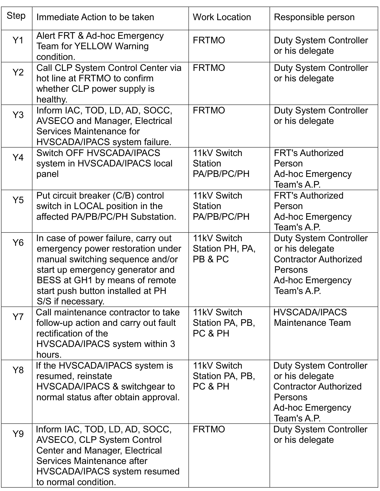  

6.2 Scenario 2 – BROWN warning condition Condition: CLP power healthy + HVSCADA/IPACS system FAILURE + Activation of supply transfer due to false signal (FULL supply transfer completed)  

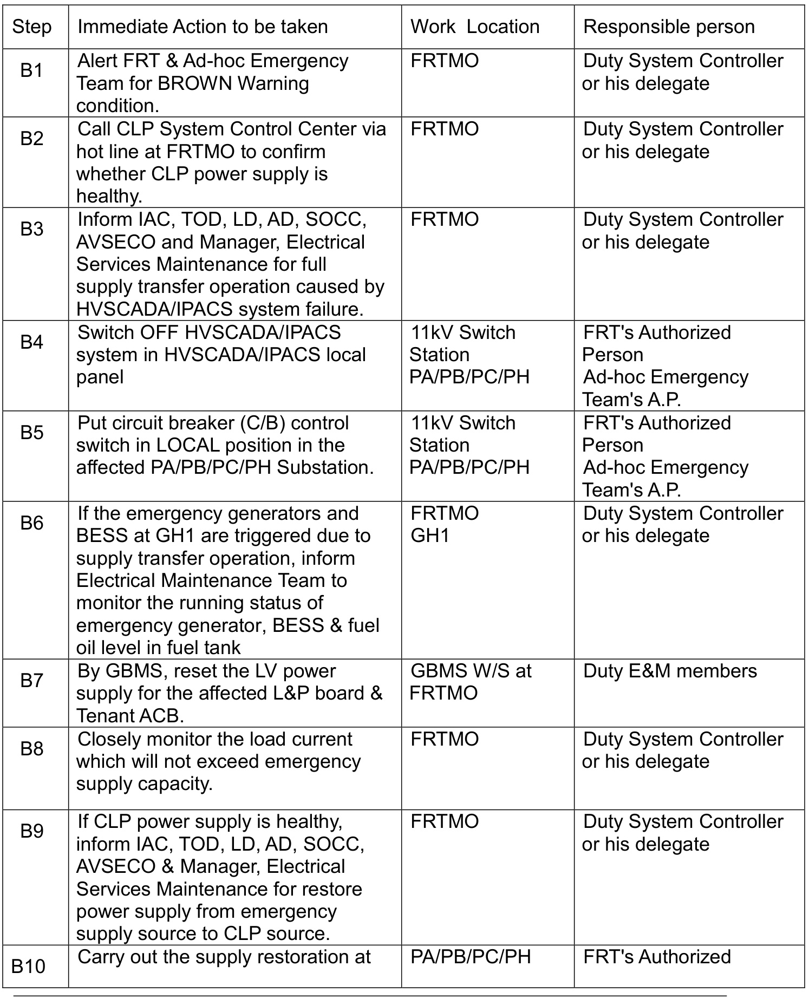  

# Airport Authority Hong Kong  

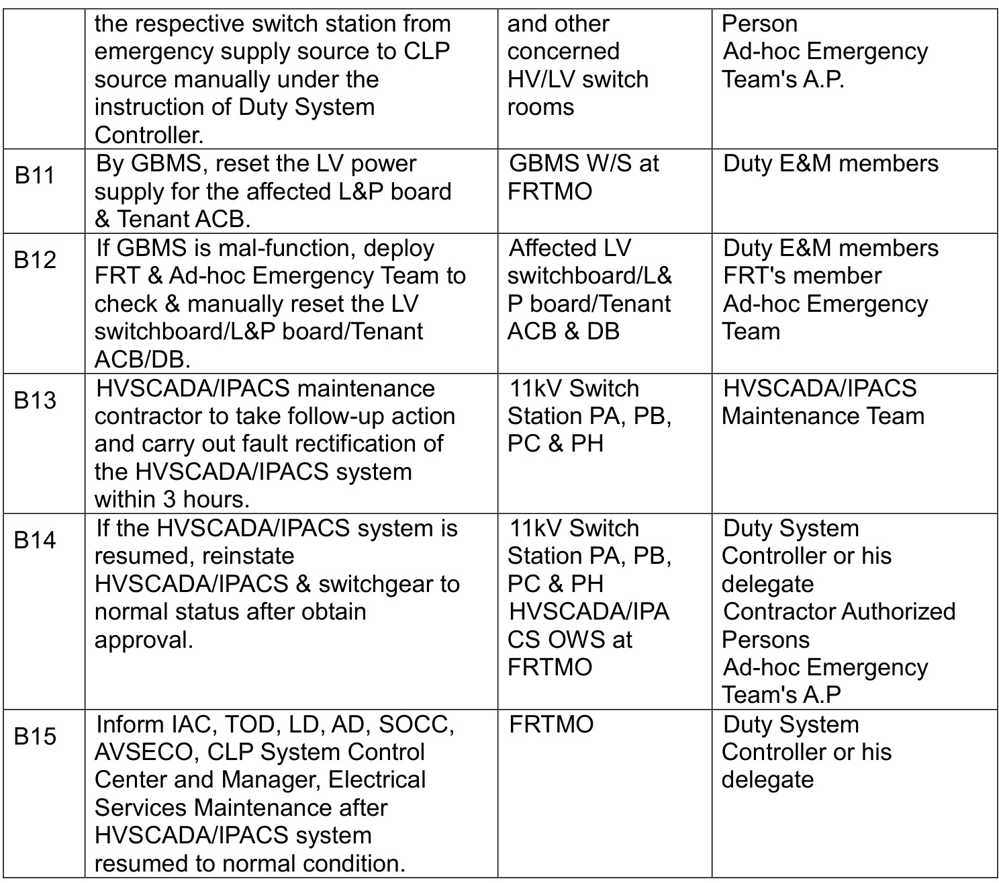  

6.3 Scenario 3 – ORANGE warning condition Condition: CLP power healthy + HVSCADA/IPACS system FAILURE + Activation of supply transfer due to false signal (PARTIAL supply transfer completed)  

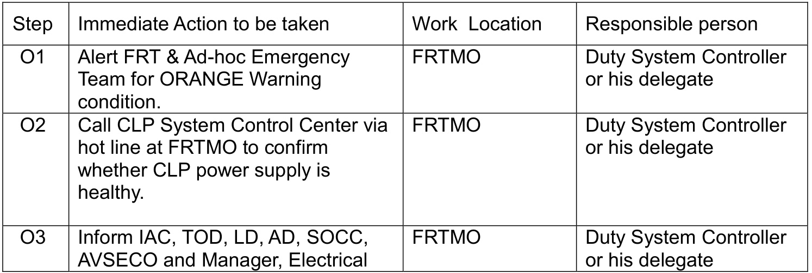  

# Airport Authority Hong Kong  

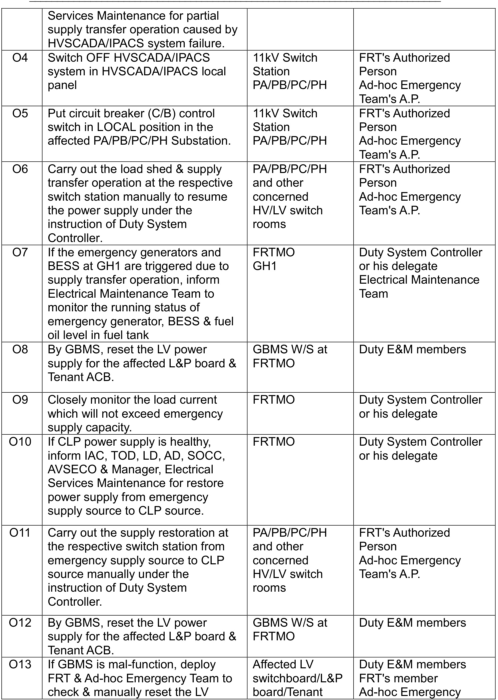  

# Airport Authority Hong Kong  

Business Continuity Manual: BCP – E4. Power Distribution System   

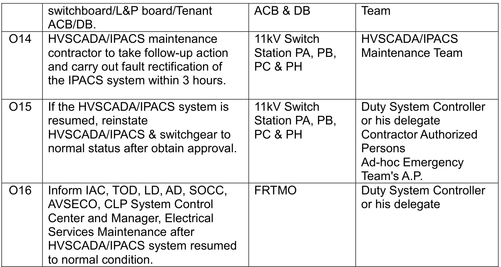  

6.4 Scenario 4 – RED warning condition Condition: CLP power failure + HVSCADA/IPACS system healthy   

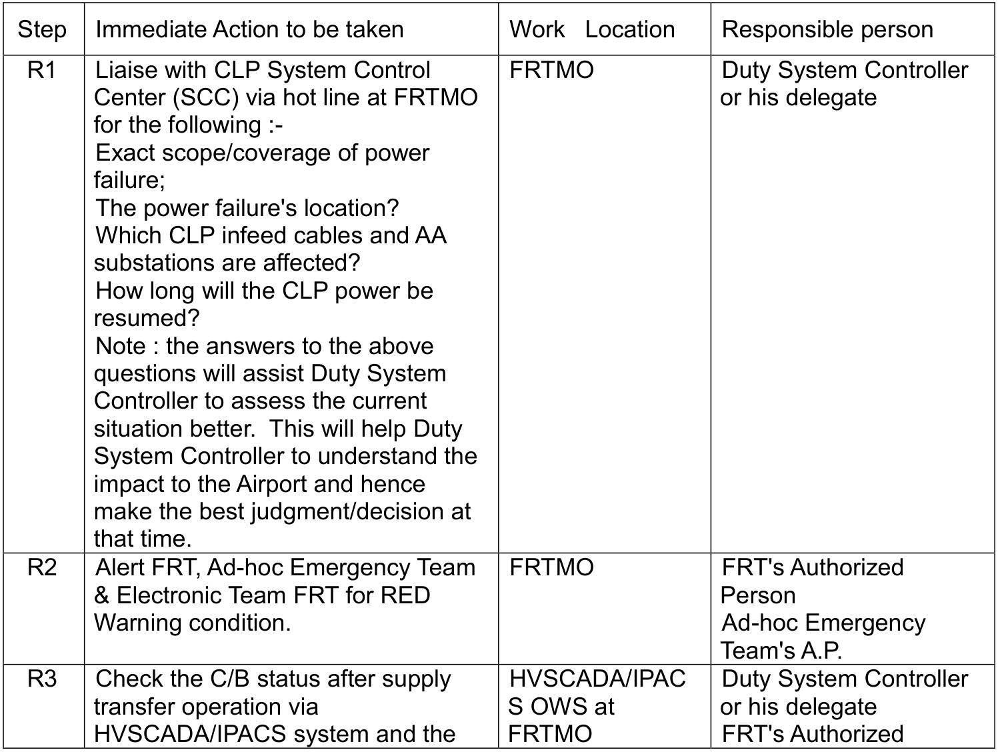  

# Airport Authority Hong Kong  

Business Continuity Manual: BCP – E4. Power Distribution System   

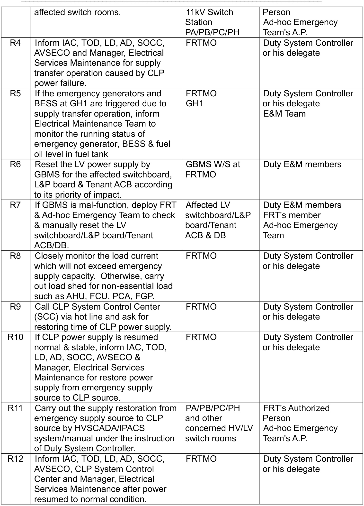  

6.5 Scenario 5 – BLACK warning condition Condition: CLP power FAILURE + HVSCADA/IPACS system FAILURE   

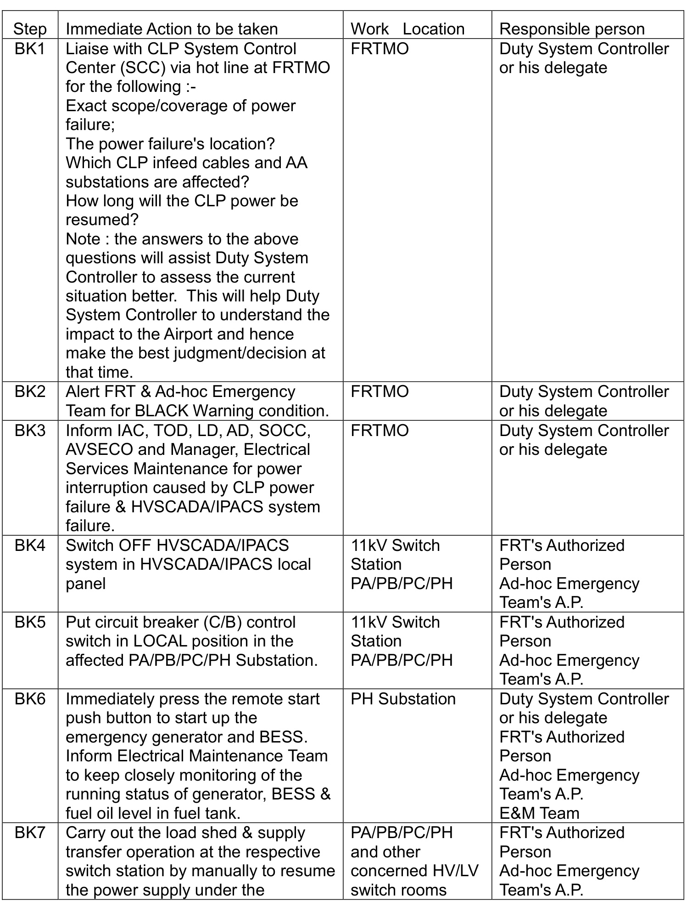  

Airport Authority Hong Kong Business Continuity Manual: BCP – E4. Power Distribution System   

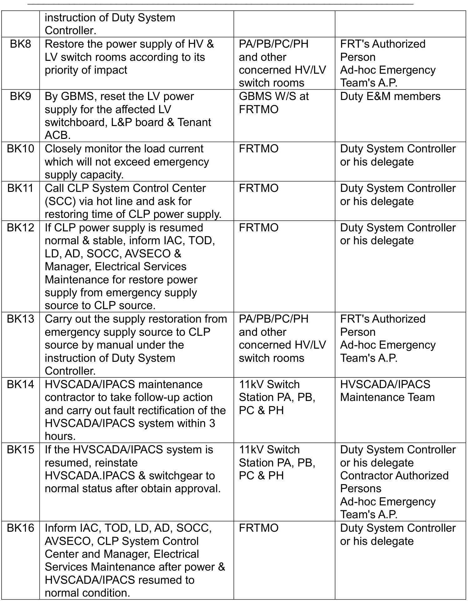  

# Contingency Procedures during the passage of Tropical Cyclones  

1.0 When typhoon signal no. 1 or above is hoisted, maintenance contractor shall be alerted by TSI Typhoon Support Team or FRT Assistant Manager, Fault Response for performing the typhoon precautionary work such as electrical plant rooms inspection with checklist to ensure the electrical system are under normal  condition when instructed.  

2.0 TSI Typhoon Support Team shall coordinate with maintenance contractor to provide sufficient manpower as stipulated in the maintenance contract, with all necessary tools and equipment to perform the typhoon precautionary work in a safe and efficient manner.  

3.0 After lowering of the typhoon signal and completion of the inspection of all electrical plant rooms and ensure the electrical system are under normal  condition, TSI Typhoon Support Team may official dismiss maintenance contractor’s typhoon precautionary team  

# E. Cyber Security  

System cyber security threat level based on the following risk rating:  

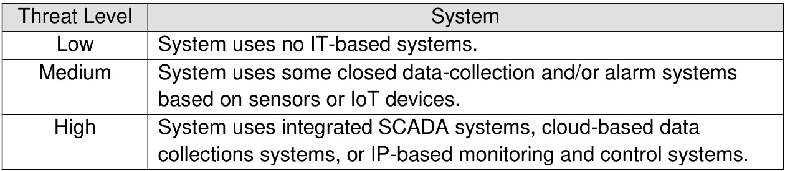  

Power Distribution System – Threat Level: High  

# Rationale for threat level  

Power Distribution System uses HVSCADA and IPACS system for monitoring the status of the HV distribution system and GBMS system for monitoring the status of the LV distribution system.  

# Mitigation actions taken  

Access to the locations of system workstations are restricted. Only authorized person is allowed to control the system. Further action may be taken on the results of the TS OT Systems Information System Cybersecurity Vulnerabilities survey.  

In case of suspected cyber-attack, Risk & Cybersecurity Team of ITD shall be informed for further investigation.  

# F. Interface with Other Operational Organizations during Contingency  

1.0 FRTMO   
2.0 IAC   
3.0 CLP Power System Control Center   
4.0 TOD   
5.0 LD   
6.0 AD   
7.0 CAD   
8.0 SOCC   
9.0 AVSECO  

End of BCP – E4  

Blank Page  