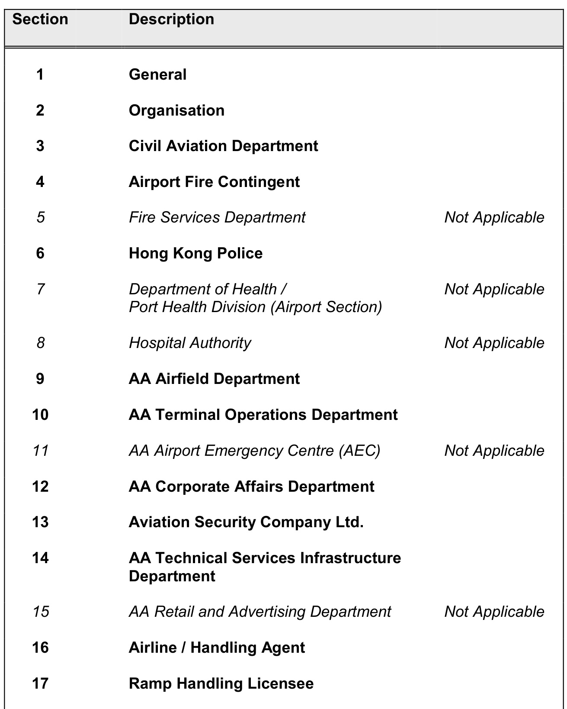
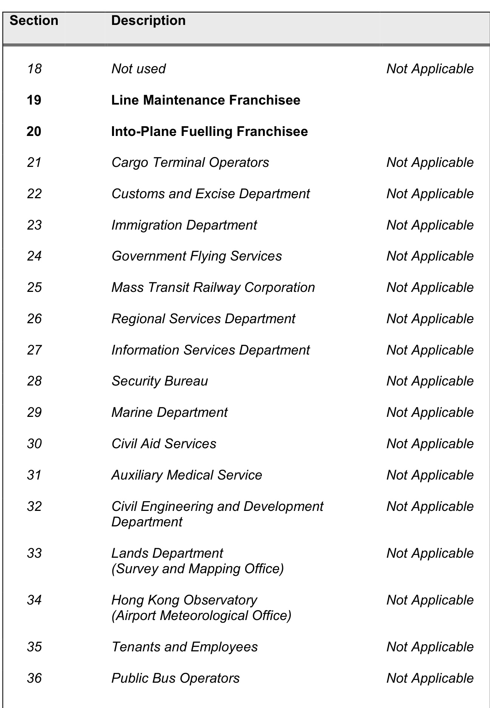
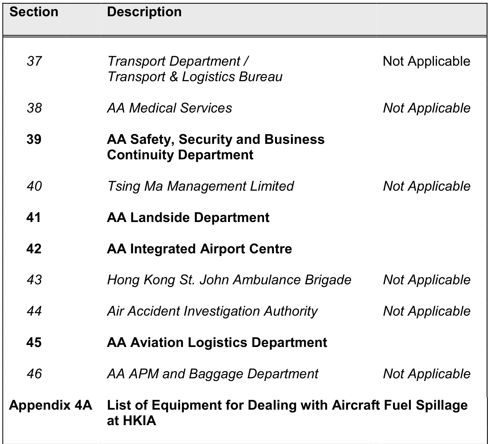
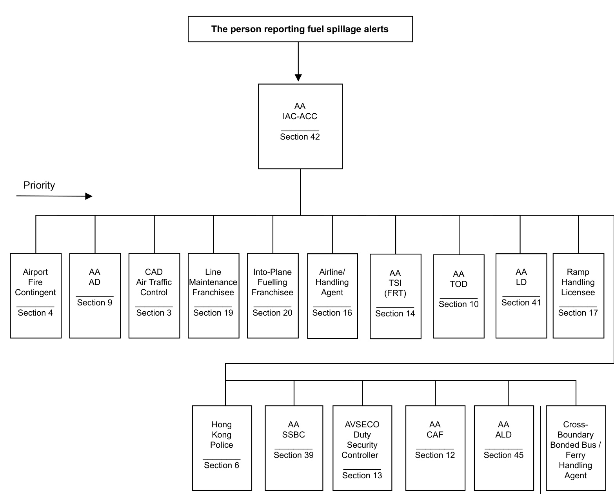
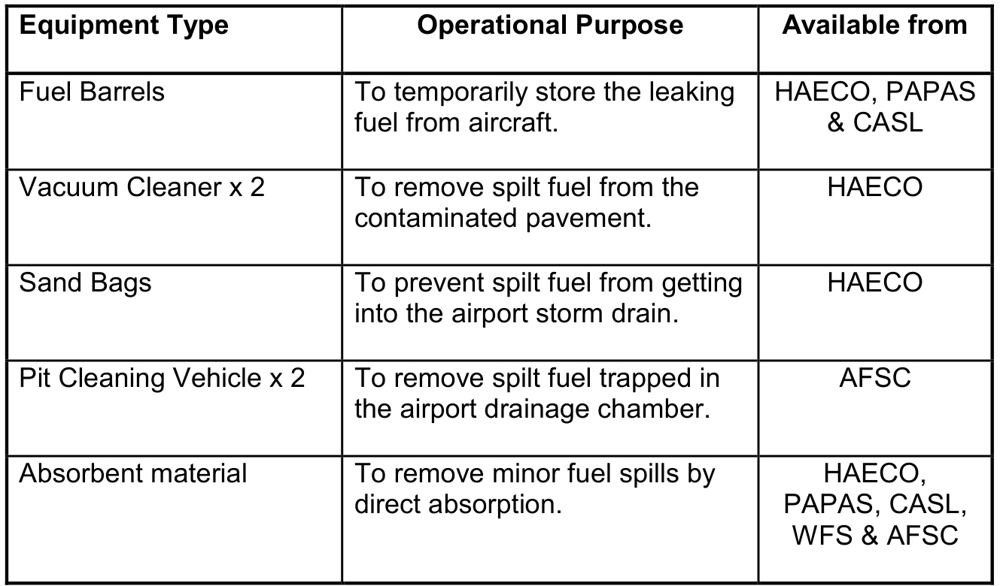

# PART 4A  

# FUEL SPILLAGE FROM AIRCRAFT  

CONTENT  

  

  

  

This page has nil content  

# GENERAL  

# 1. Introduction  

1.1 The Airport Authority’s Airport Operations Manual – Airfield Operations stipulates the requirements in the aircraft fuelling procedures, including fuelling and de-fuelling into / from aircraft. A Civil Aviation Department document, CAD 748 Aircraft Fuelling and Fuel Installation Management (Sept 2007), also provides guidance on safety measures during fuelling operations.  

1.2 In the event of a fuel spillage from aircraft, immediate actions should be taken to stop, contain and remove the spilt fuel to prevent any safety hazard and contamination to the environment arising thereat.  

1.3 This part stipulates emergency response procedures required for a fuel spillage incident involving aircraft during servicing or manoeuvring in the Airside Operational Area.  

1.4 Due to impact of fuel spillage on airside operations, fuel spillage is categorised into minor spill and major spill. This categorisation helps to decide if a full response activity is necessitated.   As a general guidance, minor spill refers to spill of or less than 20 litres and not of a running nature.  Major spill refers to spill of more than 20 litres or of a running nature.  

1.5 Equipment for dealing with aircraft fuel spillage at Hong Kong International Airport is provided in Appendix 4A of this Part.  

# 2 Roles and Responsibilities  

# Into-plane Fuelling Franchisee  

2.1 The Into-plane Fuelling Franchisee shall immediately stop the fuel flow and notify Engineer-in-charge of the Line Maintenance Franchisee and IAC-ACC of the spill. The Into-plane Fuelling Franchisee is responsible to clean up the affected area if the spill is less than 20 litres and not of a running nature.  

# Line Maintenance Franchisee  

2.2 The Line Maintenance Franchisee shall notify IAC-ACC of the spill and provide technical management of the spill including assessing whether the spill is minor or major. In the event of a major spill or running fuel spill, Line Maintenance Franchisee shall make arrangement to stop the fuel spill from the aircraft and shall also co-ordinate with the AA Incident Coordinator and communicate with the aircraft commander / crew regarding the spill.  The franchisee will provide response to contain and remove the spilt fuel.  

# Airport Authority  

2.3 The Airport Authority will alert AFC on receipt of fuel spillage notification, regardless whether it is minor or major spill. The AA Incident Coordinator will manage the response activities at the incident site including:  

Controlling people / equipment movement in the affected area   
Coordinating response activities rendered by service providers and Government departments   
Minimising disruption to airport operations and preventing safety hazards  

2.4 As an airport operator, the AA is also responsible for controlling damage to airport asset and safeguarding environmental interests arising from the incident.  

.5 The AA Incident Coordinator will also assist in cleaning up of the affected area if the spill is found on runway, taxiway and taxilane.  

2.6 The AA Manager, Sustainability in the Environmental Compliance  will stand by to provide advice for the protection of storm drains during clean up, co-ordinate with the Environmental Protection Department and Agricultural, Fisheries and Conservation Department as required.  

# Airline Operator  

2.7 If there are passengers on board the aircraft, the airline operator shall decide whether disembarkation of passengers is needed through liaison with the aircraft commander.  Any passenger movements should be supervised and assisted by the airline operator.  

2.8 The airline operator shall maintain communication with the Line Maintenance Franchisee until the conclusion of the incident.  

# Airport Fire Contingent  

2.9 The AFC will provide a suitable level of standby precaution in the vicinity of the incident site to contain any possible safety risk that may arise from the incident.  

2.10 The AFC is also responsible for providing rescue and fire fighting service if situation requires.  

# Ramp Handling Licensee  

2.11 The ramp handling licensee shall communicate with the aircraft commander for instructions on passenger and cargo handling and with the AA Incident Coordinator for services required.  

# 3 Cleaning Up of Spilt Fuel  

3.1 Fuel should not be washed into drains or culverts.  Every effort should be made to contain and recover the product.  

3.2 Contained spilt fuel and cleaning wastes / residues should be removed to a safe location for disposal.  The selection of tools and equipment to be used in removing spillage and the disposal of contaminated materials should have regard to minimizing the risk of ignition and minimizing pollution to the environment.  

This page has nil content  

# Fuel Spillage from Aircraft Alerting Diagram  

  

# Section 2  

This page has nil content  

# CIVIL AVIATION DEPARTMENT (AIR TRAFFIC CONTROL)  

# RESPONSIBILITIES  

Safeguarding taxiing aircraft ground movements Upgrading of incident, as required  

# Alerted by IAC-ACC  

Action by Air Traffic Control  

1. Direct ground movements of aircraft away from those areas affected by the incident.   
2. Maintain close liaison with IAC-ACC for possible upgrading of the incident.   
3. Maintain a chronological log of events and actions taken.  

# AIRPORT FIRE CONTINGENT  

# RESPONSIBILITIES  

Alerting   
Fire appliances cover   
Assistance to passenger evacuation if required  

# Alerted by IAC-ACC  

# Action  

1. Obtain detailed information from IAC-ACC.   
2. Despatch fire appliances to standby in the vicinity of the incident site.   
3. In the event that passenger evacuation takes place, provide assistance   
to the passengers as required.   
4. Maintain communication with AA Incident Coordinator at scene.   
5. Provide rescue and fire fighting service if situation warrants.   
6. Maintain a chronological log of events and actions taken.  

# HONG KONG POLICE  

# RESPONSIBILITIES  

Standby Assistance to passenger evacuation & reception if required Assistance on cordoning, rescue & crowd management  

# Alerted by IAC-ACC.  

# Action  

1. Despatch Police officer(s) to standby at incident scene.   
2. Maintain communication with the AA Incident Coordinator at scene.   
3. In the event that the passenger evacuation and reception is necessary, render assistance to the passengers as required.   
4. Provide assistance in cordoning of incident scene, rescue and crowd management measures if required.   
5. Maintain a chronological log of events and actions taken.  

# AA AIRFIELD DEPARTMENT  

# RESPONSIBILITIES  

Incident site management including cordoning and coordination Environmental protection and airport asset damage control Assist in cleaning up  

Alerted by IAC-ACC / upon receipt of a fuel spillage report  

# 1. Action by Apron Section  

1.1 Airfield Duty Manager will act as AA Incident Coordinator.   
1.2 Coordinate and monitor response activities on scene.   
1.3 Coordinate with into-plane refuelling franchisee to immediately stop the fuel flow and to remove the spilt fuel as soon as possible.   
1.4 Liaise with ATC for possible upgrading of the incident.   
1.5 Liaise with AFC Rescue Leader on the positioning of fire appliances around the scene   
1.6 Inform IAC-TOD if passenger disembarkation is required by the airline.   
1.7 Cordon off the incident site to control people and equipment movement.   
1.8 Ensure that all activities in the vicinity will not cause any risk of ignition.   
1.9 Decide standing down the incident in consultation with AFC and Line Maintenance Franchisee and advise IAC-ACC accordingly.   
1.10 Maintain a chronological log of events and actions taken.  

# 2. Action by Airfield Section  

2.1 Arrange with AA Technical Services Infrastructure Department to inspect the affected  area.  

2.2  Ensure precautionary measures taken to prevent fuel getting into the storm water drainage system.   
2.3 Coordinate with AA Technical Services Infrastructure Department to assist in containing and removing the spilt fuel on runways, taxiways, taxilanes and parking stand.   
2.4   Coordinate with AA airfield cleaning contractor to clean up the affected area if necessary.   
2.5 Arrange with AA Technical Services Infrastructure Department to assess damage to asphaltic or other surfaces.   
2.6   Maintain chronological log of events and actions taken.  

# AA TERMINAL OPERATIONS DEPARTMENT  

# RESPONSIBILITIES  

Maintaining passenger terminal operation Communication and co-ordination  

# Alerted by IAC-ACC  

Action by AA Terminals and Landside Duty Manager  

1. Alert Terminal Operations Department duty staff members to standby.   
2. Co-ordinate the adjustment of boarding gates allocation for APV Lounge with IAC-ACC should the spillage incident affect concerned parking stands allocation.   
3. If required, isolate the designated APV lounge for setting up of the Passenger Reception Centre for reception of the passengers and crew. 3.1 Alert IAC-ACC on designation of APV Lounge to facilitate the airside conveyance of passengers and crew. 3.2 Set up the Passenger Reception Centre in accordance with Terminal Operations Department internal procedures (Please see para. 5.1, 5.2 Section 1 & Appendix 2A of EPM Part 2). 3.3 Assist Immigration, Police, Customs & Excise Department to set up their facilities and dispatch officers to the designated APV Lounge for the processing of passengers and crew. 3.4 Request AVSECO to deploy duty staff to provide access and crowd control at the Passenger Reception Centre.  

4. Inform all concerned when the incident is stood down or upgraded.  

5. Assess implications on the passenger terminal operations.  

6. Maintain a chronological log of events and actions taken.  

This page has nil content  

# AA CORPORATE AFFAIRS DEPARTMENT  

# RESPONSIBILITIES  

Media co-ordination Issuing press release  

# Alerted by IAC-ACC  

Action by Assistant General Manager, Media & Communications  

1. Liaise with AA Assistant Manager, Airfield to ascertain details of the spillage incident.   
2. Handle media enquiries, if any.   
3. If press release is considered necessary, liaise and co-ordinate with the AA Assistant Manager, Airfield; AA Manager, Sustainability in the Environmental Compliance; Airline; CAD Public Relations Officer and Information Services Department for its preparation.   
3. Maintain a chronological log of events and actions taken.  

This page has nil content  

# AVIATION SECURITY COMPANY LTD.  

# RESPONSIBILITIES  

Safeguard security integrity Assistance in cordoning if required  

# Alerted by IAC-ACC  

1. Action by AVSECO Duty Security Controller  

1.1 Notify AVSECO Duty Security Manager.  

2. Action by AVSECO Duty Security Manager  

2.1 Liaise with AA Incident Coordinator to safeguard security integrity if disembarkation of passengers is needed and assess any security implications.   
2.2 Arrange assistance as required for the control of access and coordination at the scene of incident.   
2.3 Maintain a chronological log of events and actions taken.  

This page has nil content  

# AA TECHNICAL SERVICES INFRASTRUCTURE DEPARTMENT  

# RESPONSIBILITIES  

Assist in cleaning up upon request Damage assessment and repair  

# Alerted by IAC-ACC  

Action by Assistant Manager, Fault Response  

1. Alert the Emergency Maintenance Team to standby.  

2. Upon request by the AA Incident Coordinator, provide service to assist Into-Plane Fuelling Franchisee to contain and clean up of the spilt fuel.   
3. Conduct inspection to the affected area and to assess extent of damage and impact to any airport asset as the result of the spillage incident.   
4. Effect any necessary emergency repairs and/or cleanup works to any airport asset along with an estimate on time required.   
5. Maintain a chronological log of events and actions taken.  

This page has nil content  

# AIRLINE / HANDLING AGENT  

# RESPONSIBILITIES  

• Provision of information on passengers, crew, cargo and any dangerous goods on board   
On-scene co-ordination   
Monitoring on-scene passengers and cargo handling  

# Alerted by IAC-ACC  

Action by Airline / Handling Agent  

1. If requested, advise details of the persons on board (POB) to IAC-ACC from where information will be passed on to Airport Fire Contingent and IAC-TOD.   
2. If requested, advise if any dangerous goods are on board the aircraft to IAC-ACC.   
3. Closely liaise with the aircraft commander to decide if disembarkation of passengers is needed.   
4. Provide additional staff to assist passengers if the disembarkation of passengers is required and advise the AA Incident Coordinator on scene of the arrangement.   
5. Maintain close communication with the Line Maintenance Franchisee.   
6. Inform their ground servicing franchisees.   
7. Maintain a chronological log of events and actions taken.  

This page has nil content  

# RAMP HANDLING LICENSEE  

# RESPONSIBILITIES  

Provision of aircraft handling equipment  

Alerted by IAC-ACC  

# Action by Ramp Handling Licensee  

1. Liaise with AA Incident Coordinator and airline representative on scene to provide the aircraft servicing equipment and manpower for the handling of passengers, baggage and cargo.   
2. Maintain a chronological log of events and actions taken.  

# LINE MAINTENANCE FRANCHISEE  

# RESPONSIBILITIES  

Provision of technical support Assessment of spill Clean up of major spill  

Alerted by IAC-ACC.  

Action by Line Maintenance Franchisee  

1. Provide technical management of the spill, and assist AA Incident Coordinator to assess whether the spill is minor or major.   
2. Maintain communication with the AA Incident Coordinator on scene and to provide technical support wherever necessary.   
3. Maintain communication with the aircraft commander / crew.   
4. Contain, control and clean up the affected area for a major fuel spillage (i.e. a spill more than 20 litres or of a running nature).   
5. In consultation with AA Incident Coordinator, arrange with AFSC Operations Ltd to deploy fuel suction machine for removal of fuel trapped in the oil interceptor chamber as required.   
6. Maintain a chronological log of events and actions taken.   
7. Submit initial report to AA within the end of shift of Engineer-in-charge.  

This page has nil content  

# INTO-PLANE FUELLING FRANCHISEE  

# RESPONSIBILITIES  

Fuel spillage containment, control and clean up  

Alerted by IAC-ACC (if IAC-ACC is not alerted by Into-plane Fuelling Franchisee).  

Action by Into-Plane Fuelling Franchisee  

1. Alert IAC-ACC if a fuel spillage incident is observed.   
2. Immediately stop the fuel flow.   
3. Contain, control and clean up the affected area for a minor fuel spillage (i.e. spill of or less than 20 litres and not of a running nature).   
4. Coordinate with the Engineer-in-charge of Line Maintenance Franchisee for the containment, control and clean up of major fuel spillage (i.e. spill of more than 20 litres or of a running nature).   
5. Maintain communication with the AA Incident Coordinator on scene.   
6. Maintain a chronological log of events and actions taken.  

# AA SAFETY, SECURITY AND BUSINESS CONTINUITY DEPARTMENT  

# RESPONSIBILITIES  

Assess Safety Programme implications  

# Alerted by IAC-ACC  

1. Action by Assistant General Manager, Airport Safety  

1.1 Standby to assess for any Safety Programme implications.  

This page has nil content  

# AA LANDSIDE DEPARTMENT  

# RESPONSIBILITIES  

Maintaining passenger terminal operation Communication and co-ordination  

# Alerted by IAC-ACC  

Action by AA Assistant Manager – Landside Services  

1. Alert Landside Department duty staff members to standby.   
2. Assess implications on the passenger terminal operations.   
3. Maintain a chronological log of events and actions taken.  

This page has nil content  

# AA INTEGRATED AIRPORT CENTRE  

# RESPONSIBILITIES  

Emergency alerting  

Upon receipt of a fuel spillage report  

# 1 Action by IAC-ACC  

1.1 Alert Airport Duty Manager, Assistant Manager – Airfield and Airfield Duty Manager.  

1.2 Alert the following parties:  

Airport Fire Contingent   
AA Airfield Department   
Air Traffic Control   
Line Maintenance Franchisee   
Into-Plane Fuelling Franchisee   
Airline/ Handling Agent   
AA Technical Services Infrastructure (FRT)   
AA Terminal Operations Department   
AA Landside Department   
AA Aviation Logistics Department   
Ramp Handling Licensee   
Hong Kong Police   
AA Safety, Security and Business Continuity Department   
AVSECO Duty Security Controller   
AA Corporate Affairs   
Cross-Boundary Bonded Bus / Ferry Handling Agent (if required)  

1.3 Notify the following members of AA management:  

General Manager – Airfield   
Deputy General Manager - Airfield   
Assistant General Manager - Airfield Services   
Assistant General Manager - Infrastructure Management &   
Coordination   
Assistant General Manager - Standards & Services Delivery   
AA Assistant General Manager, Airport Safety   
AA Manager, Sustainability in the Environmental Compliance (if   
fuel spill is likely to enter a storm drain)   
AVSECO Duty Security Controller (if passenger evacuation is   
needed)   
AA Assistant General Manager, Media & Communications (if fuel   
spill is likely to enter a storm drain)   
AA General Manager, Land, Property & Aviation Franchises  

1.4 Initiate incident stand down and inform all concerned.  

1.5 Maintain a chronological log of events and actions taken.  

# AA AVIATION LOGISTICS DEPARTMENT  

# RESPONSIBILITIES  

Coordination and monitoring of necessary actions taken by related ALD franchisees  

# Alerted by IAC - ACC  

# Action  

1. Inform relevant franchisees on the incident and provide update on any latest alerts.   
2. Coordinate response activities rendered by relevant franchisees where applicable.  

This page has nil content  

# List of Equipment for Dealing with Aircraft Fuel Spillage at HKIA  

  